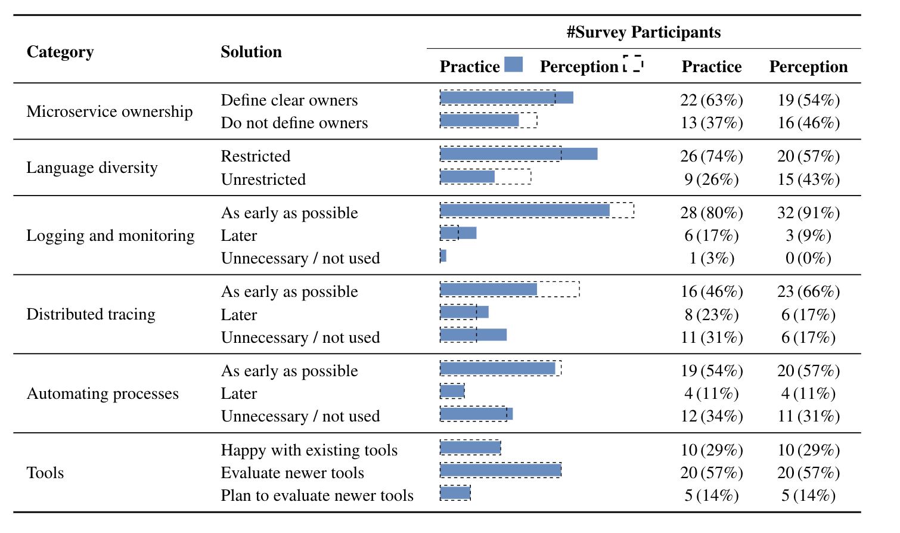
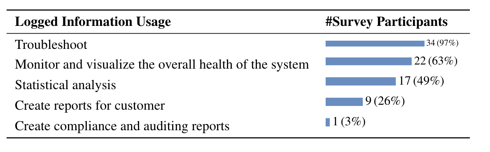

# Interview Study

## Data Analysis Process

For open coding, two of the authors of the paper independently read the transcripts line by line and identified concepts - _key ideas contained in data_. When looking for concepts, we searched for the best phrase that describes conceptually what we believe is indicated by the raw data. On a weekly basis, all the authors met to discuss the identified concepts and to refine and merge them if needed. That was done using card sorting: each card represented a quote labeled with the concepts, and we grouped the quotes and refined the concepts, as needed. 

<!--    -->

  

## Mapping Concepts to Quotes

Conceptually similar codes were grouped together to form categories. Our mapping of concepts -> subcategories -> categories is below. 

Digial version can be downloaded [here](MicroserviceStudy-1.mm). We cannot publically share quotes not included in the paper at the moment due to confidentiality issues; we will reach out to the study participants and ask for their consent, and then update the map and the manuscript. 

# Survey Study

## Survey Questions
The survey consisted of eight groups of questions and a total of 37 questions of mixed types. Most of the questions were single or multiple choices, numeric range choices, yes/no options, and open-ended text entries.

In addition to the microservice background and demographic information, we asked questions related to architectural concepts, infrastructure, and code management. In each question, participants had a chance to either agree or disagree with best practices identified during the interview study, or identify their solution for a particular challenge. We also asked participants to distinguish between the solution they apply in practice (what they do) and their perception (what they think they should do). 

Here are the list of survey questions: 

------------

Q1: How long have you been developing microservices? [Dropbox]

Q2: In your most significant microservice-based development project, how long has the team been developing microservices?  [Dropbox]

Q3: How many members are there in the team?  [Dropbox]

Q4: How many microservices does the team develop and maintain?
  * < 6
  * 6-10
  * 11-20
  * 21-30
  * 31-50
  * 51-100
  * &gt;100

Q5: How many microservices do you typically work on? 
  * < 6
  * 6-10
  * 11-20
  * 21-30
  * 31-50
  * 51-100
  * &gt;100

Q6: Are you working on commercial or open source project?
  * Commercial 
  * Open source

> Robust logging and monitoring systems are critical for efficient microservice-based development.

Q7: To what extent do you agree with the above statement in general:
1) Agree. These systems should be set up as early as possible.
2) Agree. These systems should be set up later during the project. 
3) Disagree. I do not think these systems are necessary. 
4) Other: 

Q8: In the context of your project, when did you set up logging and monitoring? 
1) As early as possible.
2) Later during the project
3) We did not set them up yet. 
4) Other:

Q9: In the context of your project, what information is being logged? [MC]
1) Up/down status of microservices
2) The number of requests each microservice receives per a certain period 
3) The input/output of each request
4) The request and response time for each call
5) Resource consumption of each microservice, such as CPU, memory, and disk
6) Other: 
  

> Distributed tracing is critical for microservice-based application development and maintenance. 

Q10: To what extent do you agree with the above statement in general:
1) Agree. Distributed tracing should be set up as early as possible.
2) Agree. Distributed tracing should be set up later during the project. 
3) Disagree. I do not think these systems are necessary. 
4) Other: 

Q11: In the context of your project, when did you set up distributed tracing? 
1) As early as possible.
2) Later during the project
3) We did not set it up yet. 
4) Other: 

> Automating the microservice setup process (e.g., automatically generating a microservice skeleton and plugging it into the entire product) is critical to save development time and costs.

Q12: To what extent do you agree with the above statement in general. 
1) Agree. Such a process should be set up as early as possible.
2) Agree. Such a process should be set up later during the project. 
3) Disagree. I do not think these systems are necessary. 
4) Other:

Q13: In the context of your project, when did you automate the microservice setup?
1) As early as possible.
2) Later during the project
3) We did not automate it yet. 
4) Other:

Q14: In the context of your project, how did you define the granularity of microservices? [MC]
1) By business capabilities (i.e., grouping code that performs the same high-level functionality).
2) By data access (i.e., grouping code that accesses the same data).
3) By dependencies (i.e., grouping code that depends on a similar set of other sub-systems).
4) By delivery lifecycle (i.e., grouping code that has to be released together).
5) By team structure (i.e., grouping code that is developed by the same team).
6) By resource consumption (i.e., to ensure that the split into microservices does not result in excessive resource consumption due to containerization, etc.) 
7) Other:

> Each microservice can be developed using its own programming language. 

Q15: To what extent do you agree with the above statement in general:
1) Agree. Always use the most appropriate language for each microservice.
2) Disagree. A company should restrict to a specific set/number of languages to use (e.g., to facilitate an automated microservice setup process). 
3) Other:

Q16: In the context of your project, do you regulate the use of programming languages? 
1) No. Always use the most appropriate language for each microservice.
2) Yes. There is a restricted number / set of languages to use.
3) Other:

> Each microservice should be owned by a specific person or team.

Q17: To what extent do you agree with the above statement in general:
1) Agree. 
2) Disagree. A company should not define owners for microservices.
3) N/A. Microservice ownership is not an important issue to consider.
4) Other:

Q18: In the context of your project, do you identify microservice owners? 
1) Yes. We define a clear owner for each microservice
2) No. We do not define owners for microservices.
3) Other: 

Q19: If you specify service owners, what are their responsibilities? [MC]
1) Troubleshoot their microservice
2) Fix bugs in their microservice 
3) Decide on the design and architecture of their microservice
4) Implement new feature requests
5) Other:

> In microservice-based development, some code is shared by multiple microservices, e.g., the code of authentication, logging, and monitoring. 

Q20: How should one manage such common code?
1) As a standalone library that is used by other microservices. Have one version of the library that is used in all microservices. 
2) As a standalone library that is used by other microservices. Allow different microservices to use different versions of a shared library. 
3) As a standalone microservice.
4) As a standalone microservice that runs as a sidecar.
5) Other:

Q21: In the context of your project, how do you manage common code?
1) As a standalone library that is used by other microservices. We have one version of the library that is used in all microservices. 
2) As a standalone library that is used by other microservices. We allow different microservices to use different versions of a shared library. 
3) As a standalone microservice.
4) As a standalone microservice that runs as a sidecar.
5) We do not have any common code. 
6) Other:

> Different customers might get a different variant of the developed product.

Q22: How should one implement such variants? 
1) Use feature flags/toggles (run-time decision)
2) Use role-based access: we check if the client has access to the called API (run-time decision)
3) Use separate deployments: independent modules are combined for each deployment as needed (build-time decision)
4) Other:

Q23: In the context of your project, how do you implement variants: 
1) Using feature flags/toggles (run-time decision)
2) Using role-based access: we check if the client has access to the called API (run-time decision)
3) Using separate deployments: independent modules are combined for each deployment as needed (build-time decision)
4) N/A: we do not have variants.
5) Other:

Q24: In the context of your project, how do you manage API changes? [MC]
1) Via direct API calls
2) Via a proxy, such as API gateway
3) Via a client library, such as Swagger
4) Via a message broker, such as RabbitMQ
5) Other:

> There are currently more than 200 free and commercial tools in the Cloud Foundation website for supporting microservice-based engineering. Moreover, new tools are frequently developed and become available. 

Q25: In the context of your project, how do you deal with the plurality of tools? 
1) We are happy with the tools that we have and rarely look for opportunities to replace them. 
2) We often evaluate our toolset and extend it when better tools become available. 
3) We plan to evaluate our toolset but did not do that yet. 
4) Other:

Q26: What is the next big challenge for microservices?

Q27: Any additional comments / suggestions you want to share with us?

Q28: Did you participate in our earlier interview study?
1) Yes
2) No 

Q29-Q36: The following questions are intended to collect demographic information about the survey participant. The questions are fully optional but your answers will be highly appreciated.

1) How long have you been working in industry? [Dropbox]
2) Which company do you work at? 
* How long have you been working at the company?  [Dropbox]
* What is your job title?
* What type of application are you developing?
* What is your age? [Dropbox]
* What is your gender? [Dropbox]
* What is the highest degree that you have received? [Dropbox]

Q37: If you would like to receive the results of the study, please fill out your contact information. This information will only be used to contact you with the results. It will not be associated with your other input during data aggregation.

Name :  

Email :    

Thank you very much for taking the time filling in the survey, we sincerely appreciate your help! 

------------ 

## Survey Data 
We received a total of 148 responses; 44 of them were complete (completion rate: 29.7%) and 28 satisfied the same participant selection criteria we applied for interview study: at least two years of microservice development experience. Here are the survey results:

(1) Perceptions of Survey Participants:

(2) Alternative Solutions Applied by Survey Participants:

(3) Logged Information: 

(4) Logged Information Usage

(5) Service Owner Responsibilities

